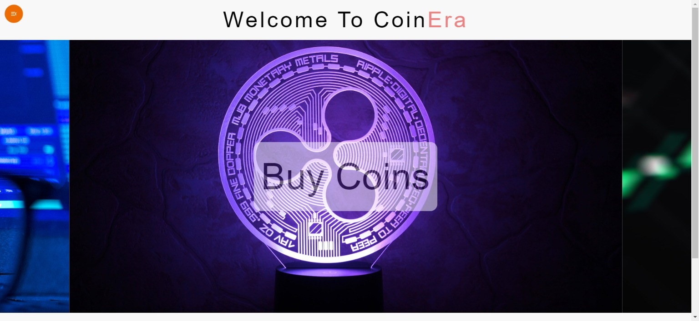
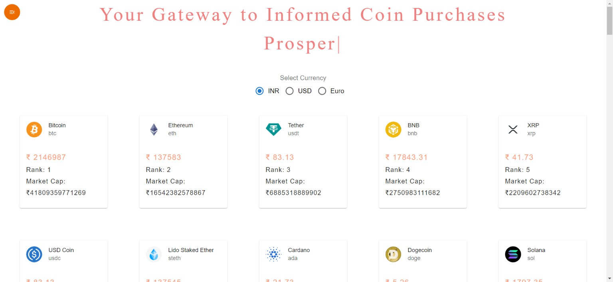
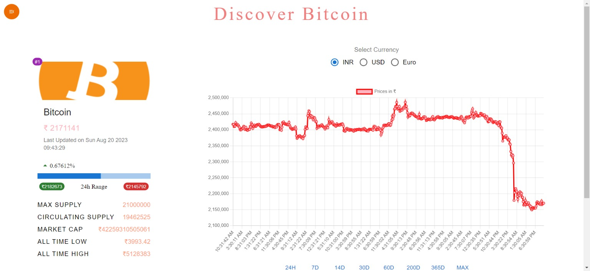

# CoinEra - Cryptocurrency Information and Exchange Details



CoinEra is a comprehensive cryptocurrency website built using ReactJS and Material-UI, powered by the CoinGecko API. It provides users with up-to-date information about various cryptocurrencies, including live details, historical price charts, and exchange data. Whether you're a crypto enthusiast, trader, or just curious about the world of digital currencies, CoinEra has you covered.

## Features

- **Live Cryptocurrency Details:** Get real-time information about the latest price, market cap, volume, and other crucial data for any cryptocurrency of your choice.

- **Exchange Details:** Explore exchange-specific data such as trading volume, liquidity, and more for each cryptocurrency.

- **Interactive Historical Charts:** Visualize the price history of cryptocurrencies using interactive charts powered by Chart.js and React Chartjs-2.

- **User-Friendly Interface:** The sleek and intuitive Material-UI design ensures a seamless user experience.

- **Responsive Carousel:** The built-in carousel allows you to quickly scroll through the top cryptocurrencies.

## Screenshots


_Real-time cryptocurrency details and exchange information._


_Historical price chart with interactive features._


_Sleek carousel showcasing top cryptocurrencies._

## Installation

1. Clone this repository:

   ```bash
   git clone https://github.com/KamalJoshi-web/CoinEra.git
   ```

2. Navigate to the project directory:

   ```bash
   cd CoinEra
   ```

3. Install the dependencies using npm or yarn:

   ```bash
   npm install
   # or
   yarn install
   ```

4. Obtain a free API key from [CoinGecko](https://coingecko.com/en/api) and replace `'YOUR_API_KEY'` with your actual API key in the `src/api/coinGecko.js` file.

5. Start the development server:

   ```bash
   npm start
   # or
   yarn start
   ```

6. Open your browser and navigate to `http://localhost:3000` to access CoinEra.

## Dependencies

- [React Router](https://reactrouter.com/): For handling navigation and routing within the app.
- [Material-UI](https://material-ui.com/): A popular React UI framework for creating visually appealing and responsive user interfaces.
- [Axios](https://axios-http.com/): A promise-based HTTP client for making API requests.
- [Chart.js](https://www.chartjs.org/) and [React Chartjs-2](https://github.com/reactchartjs/react-chartjs-2): For creating interactive and visually pleasing charts.
- [React Spinner](https://www.npmjs.com/package/react-spinners): A collection of loading spinner components for React.
- [Typewriter Effect](https://www.npmjs.com/package/typewriter-effect): A React component for creating a typewriter-like text effect.

## Contribution

Contributions to CoinEra are welcome! Feel free to open issues and submit pull requests to help improve the project.

## License

This project is licensed under the MIT License - see the [LICENSE](LICENSE) file for details.

---

**Disclaimer:** CoinEra is a personal project and is not affiliated with or endorsed by CoinGecko or any other cryptocurrency platform. Cryptocurrency prices are volatile and can change rapidly. Always do your own research before making any investment decisions.
